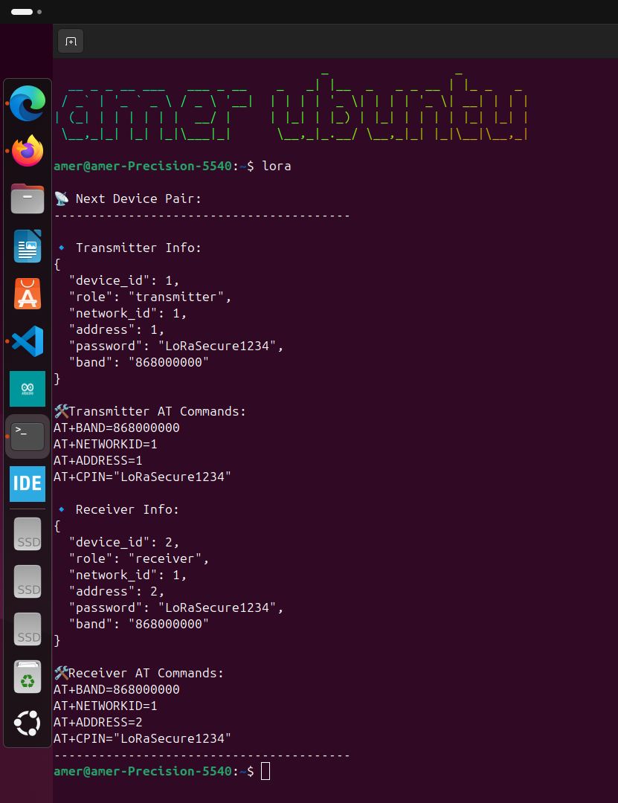

## 📄 LoRa Device Configuration & AT Command Automation — Documentation

### 🔧 System Overview

This setup automates the generation and management of LoRa RYLR896 module configurations by:

* Assigning unique `network_id` and `address` values
* Storing configs in a structured `JSON` file
* Printing ready-to-use `AT` command strings
* Saving script progress to resume generation later

---

### 📁 Files Structure

| File Name             | Description                                                |
| --------------------- | ---------------------------------------------------------- |
| `lora_nodes.json`     | Stores all generated device entries (TX/RX)                |
| `state.json`          | Stores the index pointer of the last served device pair    |
| `generate_devices.py` | Script to generate all TX/RX device pairs and save to JSON |
| `get_next_pair.py`    | Script to output the next TX/RX pair with AT commands      |

---

### 📦 JSON Format (`lora_nodes.json`)

Each entry represents a LoRa module configuration:

```json
{
  "device_id": 1,
  "role": "transmitter",
  "network_id": 1,
  "address": 1,
  "password": "LoRaSecure1234",
  "band": "868000000"
}
```

---

### ⚙️ Script 1: Generate All Devices (`generate_devices.py`)

**Purpose:** Create all device entries for all `network_id`s from `1` to `16`, with addresses `1` to `65534`. Each TX/RX pair is assigned sequential addresses within a network.

**Command to run:**

```bash
python3 generate_devices.py
```

It saves the data to `lora_nodes.json` safely without duplicating entries if they already exist.

---

### ⚙️ Script 2: Get Next Pair (`get_next_pair.py`)

**Purpose:** On each run:

* Outputs the next available TX/RX device pair
* Prints AT commands for each
* Updates `state.json` to track progress

**Command to run:**

```bash
./get_next_pair.py
```

**What it prints:**

* Device JSON info
* Corresponding `AT` command strings:

  ```
  AT+BAND=868000000
  AT+NETWORKID=1
  AT+ADDRESS=1
  AT+CPIN="LoRaSecure1234"
  ```

---

### 💾 State Management

| File         | Key             | Purpose                         |
| ------------ | --------------- | ------------------------------- |
| `state.json` | `current_index` | Index of next unused TX/RX pair |

If `state.json` doesn't exist, it starts from the beginning.

To **reset the state** and start from the beginning:

```bash
rm state.json
```

---

### 🔐 Default Configuration Values

| Field           | Value                     |
| --------------- | ------------------------- |
| Band            | `868000000`               |
| CPIN            | `"LoRaSecure1234"`        |
| NetworkID Range | `1–16`                    |
| Address Range   | `1–65534` (per NetworkID) |

---

### 🧪 Example Output

```bash
📡 Next Device Pair:
----------------------------------------

🔹 Transmitter Info:
{
  "device_id": 1,
  "role": "transmitter",
  "network_id": 1,
  "address": 1,
  "password": "LoRaSecure1234",
  "band": "868000000"
}

🛠️ Transmitter AT Commands:
AT+BAND=868000000
AT+NETWORKID=1
AT+ADDRESS=1
AT+CPIN="LoRaSecure1234"
```

---

### ✅ Advantages

* No address or network reuse
* Easy recovery using state tracking
* No duplication or overwriting
* Portable and readable JSON
* Command-ready AT strings

---
### ⚙️⚙️ linux like util **lora** 
* in any place run **lora** CMD in terminal it will generate node data 
* generate the TX /RX node data 
* avoiding Repetition **uni node data**
